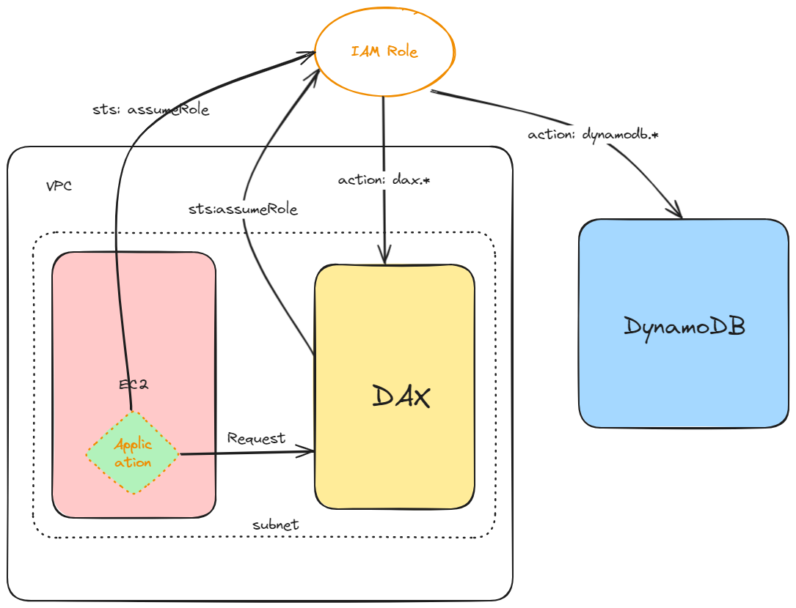

# Resources

To test dax cluster, you need the following resources to be created.
1. A dynamodb table
2. A dax cluster
3. An EC2 instance, where your request to dax is sent from. (This repo doesn't include the terraform to create EC2 instances)
4. An IAM role which can be assumed and has access to both DAX cluster & dynamodb table
5. An IAM user which can assume the above role



# Test
1. Login to the EC2 instance
2. Generate AWS credentials for the IAM user you just created from the terraform
3. Run `aws configure` to configure the credentials
4. Set environment variables
   ```
   export DAX_ENDPOINT=
   export DAX_IAM_ROLE=
   export DAX_TABLE_NAME=<The DyanmoDB table>
   ```
5. Run `python dax_playground.py`